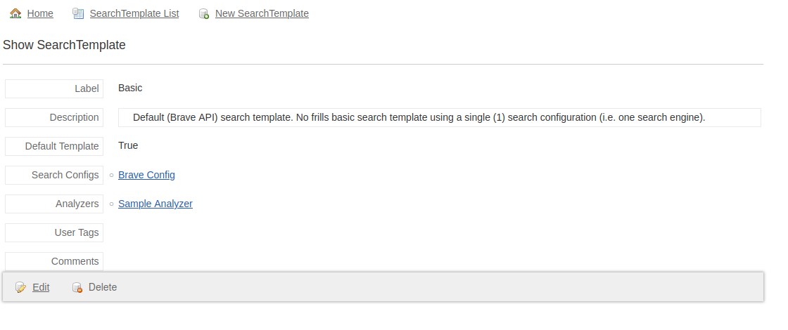
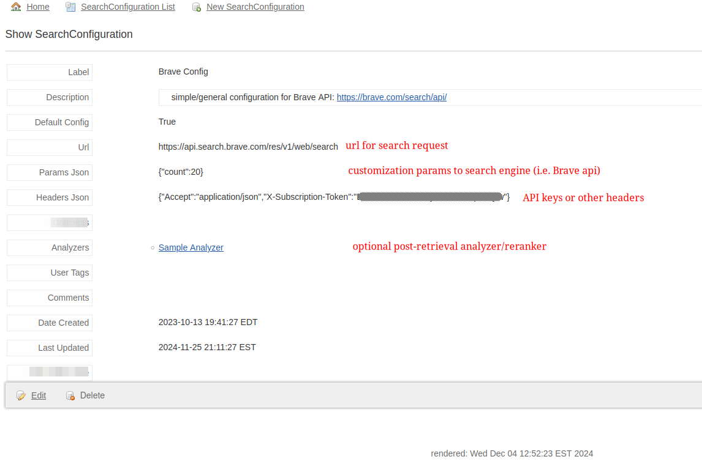

# CourageousSearch

## Overview

This is an opensource search environment designed for users (searchers) who want more ownership and control over their search process.

`CourageousSearch` _(CS)_ started as a grails proof-of-concept. It was significantly motivated by the Brave organization and Brave Search API. More recently, we decided to move from Grails to SpringBoot, and chose JHipster as our opinionated starting point.

The most basic use looks like:

- Enter a search query in the search box
  - using default `Brave SearchTemplate` & `Brave SearchConfiguration`
- CS **processes** request
  - send request to Brave Search API
  - download all returned URLs
  - parse and process result documents
- CS presents user results for browsing/annotating, with UI tools to:
  - boost/bury of source site
  - boost/bury of source document
  - boost/bury of text fragments (paragraphs, sections, manually highlighted text,...)
  - additionally tag or comment any/all of the above
- Results & annotations saved for later review/analysis
  - Search-as-you-type (SAYT) functionality enables 're-finding' previous searches and boosted `Answers`
- Post-processing
  - ML/LLM analysis _(search, results, annotations,...)_
    - summarization
    - keyword extraction
    - classification/categorization
    - predict `userTags` for new content
  - semantic similarity search

## How-to and ScreenShots

- SearchTemplate
  
- SearchConfiguration
  
- Search
- 
